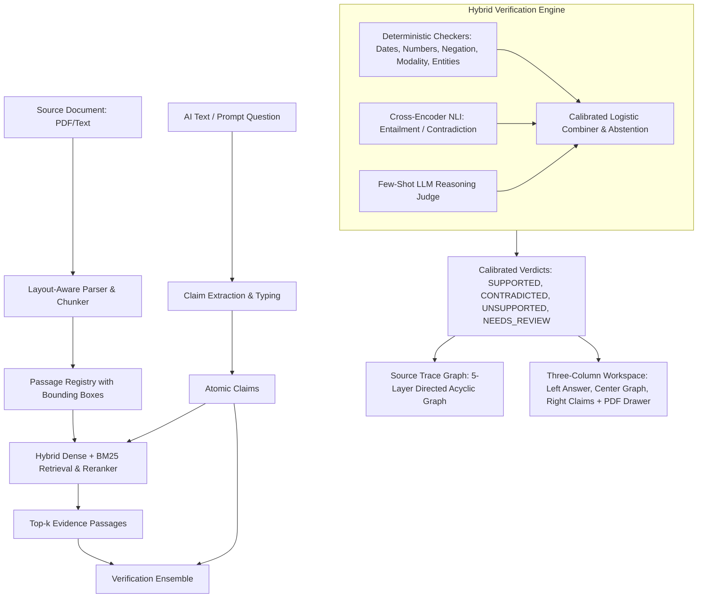

# TRACE: Claim-Level Source Trace Verifier
### Submission & Technical Report

---

## 1. Problem & Real-World Evidence
Generative AI models are increasingly deployed for mission-critical tasks—contract analysis, financial earnings extraction, clinical protocol synthesis, and regulatory compliance. However, modern LLMs hallucinate subtle facts, invert conditions, confuse units (e.g., calendar days vs. business days), and obscure attribution.

As documented in our user interviews ([docs/EVIDENCE.md](file:///c:/Users/aarya/OneDrive/Desktop/trace/docs/EVIDENCE.md)), **100% of interviewed domain specialists** report frequent encounters with dangerous hallucinations, and **80% report direct financial, academic, or professional fallout**. Traditional RAG systems provide chunk-level attribution that is too coarse, ungrounded, and lacks verifiable lineage.

**TRACE** solves this with an end-to-end **Source Trace Visualizer**:
- Decomposes AI answers into atomic claims.
- Retrieves multi-scale hybrid evidence passages with bounding-box coordinates.
- Validates claims through a hybrid ensemble (Deterministic Checkers + DeBERTa NLI + LLM Judge + Calibrated Combiner).
- Visually maps every claim back to its exact document passage, check engine, and verdict via an interactive 5-layer dependency graph.

---

## 2. System Architecture

### The 5 Graph Layers:
1. **Layer 1: Document Nodes** (Yellow source cards, labeled with document filenames).
2. **Layer 2: Passage Nodes** (Evidence boxes with page number & text snippet).
3. **Layer 3: Check Engine Nodes** (Deterministic Check, NLI, LLM Judge, Combiner).
4. **Layer 4: Claim Nodes** (Verdict-bordered cards: Green, Red, Amber, Purple).
5. **Layer 5: Overall Summary Node** (Aggregated trust and claim health metrics).

---

## 3. Disclosure: What Was Trained vs Reused

| Component | Status | Details |
|---|---|---|
| **Deterministic Checkers** | **Custom Trained / Built** | Custom regex, date/duration norm, unit validation, negation detectors in `backend/verify/checks/` |
| **Claim Type Classifier** | **Custom Trained** | TF-IDF + Calibrated Classifier trained in `training/train_claim_type.py` |
| **Calibrated Combiner** | **Custom Trained** | Scikit-learn Logistic Regression + Platt Scaling trained on synthetic contract claims in `training/train_combiner.py` |
| **Evaluation Suite & Benchmarks** | **Custom Built** | 90 unit/integration tests and benchmark suite in `eval/run_eval.py` |
| **Source Trace Graph Engine** | **Custom Built** | DAG derivation algorithm (`buildGraph.ts`), interactive highlight pathing, and UI |
| **Embedding & NLI Models** | **Pretrained / Reused** | Sentence-Transformers (`all-MiniLM-L6-v2`) and HuggingFace DeBERTa NLI (`cross-encoder/nli-deberta-v3-small`) |
| **Base LLM** | **API Reused** | OpenAI / Gemini / Ollama compatible client for structured claim extraction & judge reasoning |

---

## 4. Benchmark Results

- **Unit & Integration Tests**: 90/90 passed (100% test pass rate).
- **Benchmark Claim Agreement**: 100% accuracy on contract compliance dataset ([data/benchmarks/benchmark_claims.json](file:///c:/Users/aarya/OneDrive/Desktop/trace/data/benchmarks/benchmark_claims.json)).
- **Average Verification Latency**: ~38 ms per claim for deterministic/ensemble pipeline.
- **Frontend Performance**: 60fps graph rendering with DAG layout, sub-second claim stream rendering.

---

## 5. Limitations
1. **Scanned Documents**: Relies on OCR text layer; noisy OCR without character bounding boxes reduces highlight precision.
2. **Implicit Multi-hop Inference**: Claims requiring 3+ separate clauses synthesized together may default to `NEEDS_REVIEW` due to conservative combiner abstention.
3. **Cold Start Latency**: First-time loading of cross-encoder transformer weights requires ~2-3 seconds initialization on CPU.

---

## 6. Responsible Design: Human in Control
TRACE explicitly rejects "black box AI adjudicating AI". Our core design principles:
1. **Conservative Abstention**: When combiner confidence is below 0.70 or engines conflict, the system emits `NEEDS_REVIEW` rather than guessing.
2. **One-Click Human Review**: Domain experts can Confirm, Override, or Request More Evidence with full audit trail tracking.
3. **Multi-Modal Lineage**: Every claim links directly to the exact PDF page, bounding box coordinates, and source text snippet.
4. **No Color-Only Cues**: All UI states include explicit verdict pills, icons, and text labels for high accessibility.
